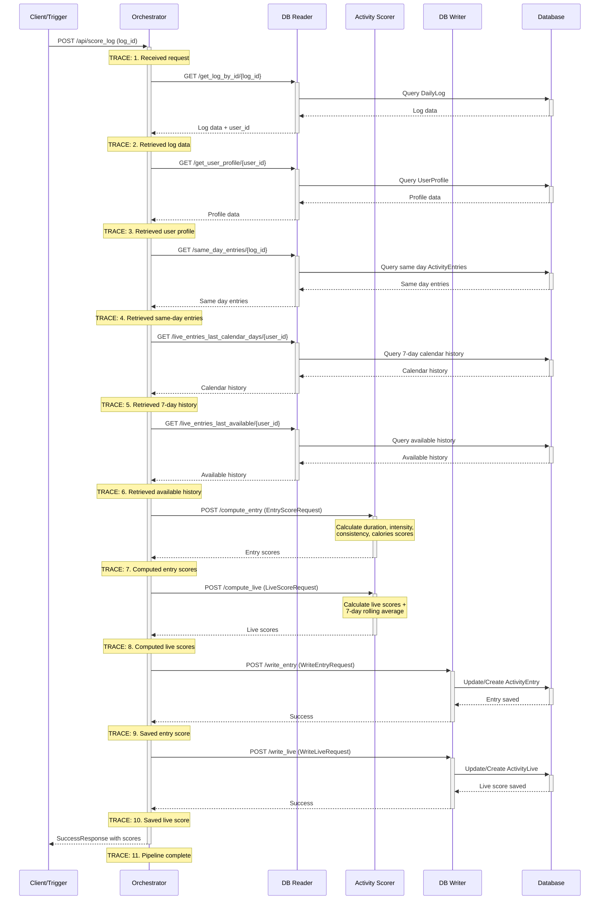

# Sumedh 2025 Internship


# Workout duration–based scoring Algorithms
Examines deficits (ie how scores short but intense workouts as zero), gives a failed logarithmic adjustment that still ignores workout intensity, & how of duration scoring remains effort-agnostic. Defines attributes/reqs for a "good" scoring function (mixture of WHO-based thresholds + partial credit for short sessions when intensity is high).

[Scoring Formula Variants](./Brainstorming%20Improvements%20to%20the%20Physical%20Activity%20Score%20Computation.pdf)


# Stress Testing Celery/Reddis for Incoming/Streaming Data
Tests varying size batches of DailyLog database entries form small batches like 10-50 entries up to hundreds &  submitting each entry as a Celery background task and measuring how long the entire process took. Caompared submission speed, task completion time, and overall throughput across different to see where the system performs most efficiently.

[Compute Tests](./Reddis%20%26%20Celery%20Execution%20Time.pdf)


# Client Logging
Frontend and backend logs aren't connected, making it impossible to trace frontend errors back to their root causes in the backend system. Can't correlate frontend errors with backend issues due to disconnected logging systems.

[Client Logging](https://github.com/Preffect-Inc/Preffect-HealthEngine/blob/main/app/views/client_log_view.py)

# Kafka Pub/Sub + Fanout
The goal was to build a robust, scalable scoring system—one that is invariant to scale, easily modifiable, and supports both real-time database score updates and downstream ML tasks. To achieve this, a resilient publisher-listener architecture was implemented, featuring thread-local producers and consumers that automatically write offsets for reliable processing.

[Kafka Backend](https://github.com/Preffect-Inc/Preffect-HealthEngine/pull/374/files#diff-f0b36047804fc1a021d20667d8da0073a215761639235064f52630a03d570e10)

# Failed Design/Directions
- **Using Django Signal**  
  Tempting for loose coupling, but problematic with Celery. Signal handlers can conflict with async task execution and complicate debugging.

- **Manual Function Routing**  
  `exec(fn + param_name)` — technically worked, but it’s an unsafe and unreadable reinvention of dispatch mechanisms. Better to rely on native routing tools. Killed.

- **Dict Packing/Unpacking**  
  Trying to avoid “slinging” by deeply nesting/unpacking dicts. Resulted in unreadable code — killed.

- **Graph-Based Execution Engine**  
  - Tasks = nodes  
  - Edges into node = required vars (used to calculate semaphores)  
  - Used topological sort for serializability  
  - Used level-order traversal to maximize parallelism  
  worked--killed due to uninterparbility and existance of airflow dag

- **Kafka-Based Event Bus**  
  Provided strong decoupling and flexibility. After implementing, descsion was made that honrizontal scaling in pods could handle flow.

# Physical Activity Pipeline: Working
<pre lang="markdown"><code>```
When a "user" sends a physical activity log-entry to our server:
User
  → Ingress
    → Django View
      → Manual Log Service
        → Daily Log Entry
          → Enqueue Celery Task to invoke pipeline
            → Orchestrator receives Log ID to process (FastAPI)
              → Invokes DB Reader Microservice (FastAPI)
              → Invokes Scoring Microservice (FastAPI)
              → Invokes DB Writer Microservice (FastAPI)
```</code></pre>


# Pipeline Sequence
This diagram is clearest desciption of my pipeline. (Note: I did not make this by hand: credits to Greptile)



# Steps to See Live Physical Activity Score Pipeline

1. **Deploy Image**  
   Use the following image tag from ACR:
   ```
   1.9.8.post5-.-g7b8ac440.d20250926t1618
   ```
2. **Stream Logs**  
   Run this command to connect to all pods in the namespace and highlight `SCORE TRACE` lines:
   ```bash
   stern --namespace preffect-sumedh . --color always | grep --color=always "SCORE TRACE"
   ```
3. **Generate Access Token**  
   [Generate Access Token via Postman](https://preffect-mvp.postman.co/workspace/Preffect-APIDocumentation~56e5032b-9980-4336-805d-8d35d8a77143/request/44929468-15295d79-580e-4b57-9906-1813e734add6?action=share&creator=44929468)

4. **Send a New Log**  
   [Send a New Log Request](https://preffect-mvp.postman.co/workspace/Preffect-APIDocumentation~56e5032b-9980-4336-805d-8d35d8a77143/request/44929468-c1baa90a-3200-4639-90f3-9b1fb9f83956?action=share&source=copy-link&creator=44929468&ctx=documentation)

5. **Terminal Trace**  ```
orchestrator-bf6748448-2gmtm orchestrator SCORE TRACE: 1. Received request for log  74a51383-0c1f-4fc2-b69c-e7210235cb89
orchestrator-bf6748448-2gmtm orchestrator SCORE TRACE: 2. Retrieved log data (user: retrieving...)
orchestrator-bf6748448-2gmtm orchestrator SCORE TRACE: GET /get_log_by_id/74a51383-0c1f-4fc2-b69c-e7210235cb89 -> {'user_id': '7c9b01d3-9f89-401c-af37-3c17d6dc355f', 'log_id': '74a51383-0c1f-4fc2-b69c-e7210235cb89', 'created_at': '2025-09-26T16:22:53.907305Z', 'datetime_filter': '2024-09-26T14:30:00Z', 'timezone': 'UTC', 'log_type': 'exercise', 'log_access_origin': 'quest_id: 74042272-ca60-410b-9cce-1b597643329f', 'source': 'manual', 'entry_method': ['manual', 'audio'], 'priority': 'first', 'data': {'notes': 'optional_string', 'new_log': True, 'duration': 6666.0, 'end_time': '2024-09-26T14:30:00+00:00', 'intensity': 1.0, 'start_time': '2024-09-26T14:30:00+00:00', 'specific_activity': 'screaming', 'distance_or_amount': 'optional string'}, 'meta_data': {}}
orchestrator-bf6748448-2gmtm orchestrator SCORE TRACE: 3. Retrieved user profile (TDEE: fetching...)
orchestrator-bf6748448-2gmtm orchestrator SCORE TRACE: GET /get_user_profile/7c9b01d3-9f89-401c-af37-3c17d6dc355f -> {'user_id': '7c9b01d3-9f89-401c-af37-3c17d6dc355f', 'date_of_birth': '1995-01-01', 'gender': 'male', 'height': '175', 'zip_code': '12345', 'additional_notes': 'Created for scoring pipeline testing', 'TDEE': 2000.0, 'BMR': 1500.0, 'BMI': 22.5}
orchestrator-bf6748448-2gmtm orchestrator SCORE TRACE: 4. Retrieved same-day entries (fetching... entries)
orchestrator-bf6748448-2gmtm orchestrator SCORE TRACE: GET /same_day_entries/74a51383-0c1f-4fc2-b69c-e7210235cb89 -> [{'id': 1, 'daily_log_id': '491d6da7-65bd-4497-b5eb-586b88ff5c10', 'duration_score': 100, 'intensity_score': 20, 'consistency_score': 80, 'calories_score': 100, 'overall_score': 75}, {'id': 3, 'daily_log_id': '45e1a02f-bf58-496e-ba20-8576e09e519f', 'duration_score': 100, 'intensity_score': 20, 'consistency_score': 40, 'calories_score': 0, 'overall_score': 53}, {'id': 4, 'daily_log_id': 'be001428-d8bd-45c9-b29e-7e90723b25fc', 'duration_score': 100, 'intensity_score': 20, 'consistency_score': 60, 'calories_score': 0, 'overall_score': 60}, {'id': 7, 'daily_log_id': 'c392d69a-8d0c-420b-8166-ebf3222e3bd5', 'duration_score': 100, 'intensity_score': 20, 'consistency_score': 80, 'calories_score': 0, 'overall_score': 67}, {'id': 8, 'daily_log_id': '3af497d6-693b-42c4-b410-c448fefd6bd5', 'duration_score': 100, 'intensity_score': 20, 'consistency_score': 100, 'calories_score': 100, 'overall_score': 80}, {'id': 9, 'daily_log_id': 'cae94511-f8fc-48a6-a76d-b1c930dccc14', 'duration_score': 100, 'intensity_score': 20, 'consistency_score': 100, 'calories_score': 0, 'overall_score': 73}, {'id': 10, 'daily_log_id': '3f358d49-ba8e-482e-9eb8-f642f7dc20dd', 'duration_score': 100, 'intensity_score': 20, 'consistency_score': 100, 'calories_score': 0, 'overall_score': 73}]
orchestrator-bf6748448-2gmtm orchestrator SCORE TRACE: 5. Retrieved 7-day history (fetching... entries)
orchestrator-bf6748448-2gmtm orchestrator SCORE TRACE: GET /live_entries_last_calendar_days/7c9b01d3-9f89-401c-af37-3c17d6dc355f -> []
orchestrator-bf6748448-2gmtm orchestrator SCORE TRACE: 6. Retrieved available history (fetching... entries)
orchestrator-bf6748448-2gmtm orchestrator SCORE TRACE: GET /live_entries_last_available/7c9b01d3-9f89-401c-af37-3c17d6dc355f -> [{'id': 1, 'user_id': '7c9b01d3-9f89-401c-af37-3c17d6dc355f', 'date': '2024-09-26', 'duration_score': 100, 'consistency_score': 20, 'calories_score': 0, 'overall_score': 73, 'seven_day_score': 73}]
orchestrator-bf6748448-2gmtm orchestrator SCORE TRACE: 7. Computed entry scores: computing...
orchestrator-bf6748448-2gmtm orchestrator SCORE TRACE: POST /compute_entry -> {'duration_score': 100, 'intensity_score': 20, 'consistency_score': 100, 'calories_score': None, 'overall_score': 73}
orchestrator-bf6748448-2gmtm orchestrator SCORE TRACE: 8. Computed live scores: computing...
orchestrator-bf6748448-2gmtm orchestrator SCORE TRACE: POST /compute_live -> {'duration_score': 100, 'consistency_score': 20, 'calories_score': None, 'overall_score': 73, 'seven_day_score': 73}
orchestrator-bf6748448-2gmtm orchestrator SCORE TRACE: 9. Saved entry score to database
orchestrator-bf6748448-2gmtm orchestrator SCORE TRACE: POST /write_entry -> {'id': 11, 'daily_log_id': '74a51383-0c1f-4fc2-b69c-e7210235cb89', 'duration_score': 100, 'intensity_score': 20, 'consistency_score': 100, 'calories_score': 0, 'overall_score': 73}
orchestrator-bf6748448-2gmtm orchestrator SCORE TRACE: 10. Saved live score to database
orchestrator-bf6748448-2gmtm orchestrator SCORE TRACE: POST /write_live -> {'id': 1, 'user_id': '7c9b01d3-9f89-401c-af37-3c17d6dc355f', 'date': '2024-09-26', 'duration_score': 100, 'consistency_score': 20, 'calories_score': 0, 'overall_score': 73, 'seven_day_score': 73}
orchestrator-bf6748448-2gmtm orchestrator SCORE TRACE: 11. Scoring pipeline complete for log 74a51383-0c1f-4fc2-b69c-e7210235cb89

# Init containers
- orchestrator-bf6748448-2gmtm › linkerd-init
- redis-0 › linkerd-init
- worker-76cf6fc999-rdkrk › linkerd-init
```


